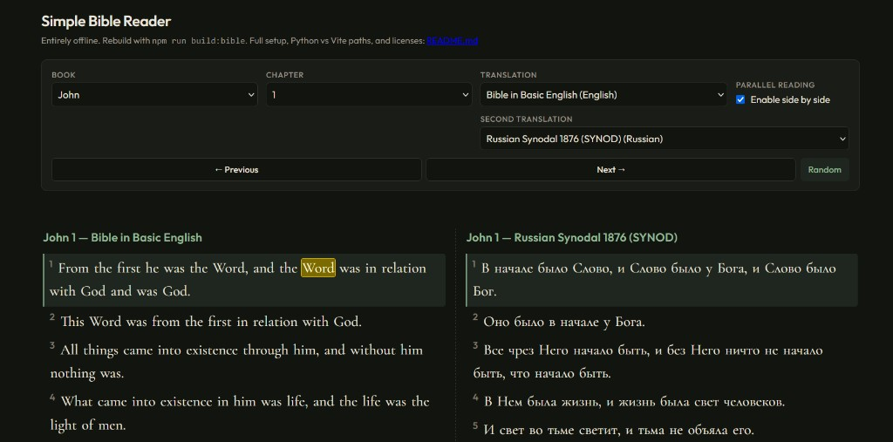

# Simple Bible Reader (offline)

A small browser app that reads **only local JSON** under `public/bible-data/`. There is **no** runtime call to bible-api.com or other Bible APIs.

## Screenshot



---

## Quick start

### 1. Generate the Bible bundle (required once)

From this directory (`bible-app/`):

```bash
npm install
npm test
npm run build:bible
```

This downloads public-domain / openly licensed sources (see [Data sources](#data-sources)) and writes:

- `public/bible-data/manifest.json` — list of translations and `dataFile` names  
- `public/bible-data/t-*.json` — one file per translation (large; often **50+ MB** total)  
- `public/bible-data/lexicon-slim.json` — compact Strong’s Hebrew/Greek glosses (from [Open Scriptures](https://github.com/openscriptures/strongs), CC BY-SA)

If these files are missing, the UI will show an error until you run `build:bible`.

### 2. Run a local web server

The app uses **ES modules** (`<script type="module">`) and `fetch()`. You must open it through **http://** or **https://**, not as a `file://` URL.

**Option A — Vite (recommended)**

```bash
npm run dev
```

Vite serves `public/` at the **site root**, so data lives at `/bible-data/…`.

**Option B — Python**

Run the server from the **`bible-app` project root** (the folder that contains `index.html` and `public/`):

```bash
cd path/to/bible-app
python -m http.server 8765
```

Then open: `http://127.0.0.1:8765/`

With Python’s default handler, `public/` is **not** mounted at `/`; files appear under `/public/`. The app **detects** this by probing, in order:

1. `/bible-data/` — matches **Vite** dev and `vite build` + `vite preview` (where `public/` is copied to the site root).  
2. `/public/bible-data/` — matches `python -m http.server` with the **project root** as cwd.  
3. `public/bible-data/` **relative to the current page URL** — matches cases where you open e.g. `http://127.0.0.1:8765/bible-app/` because the server root is a **parent** folder (still run `build:bible` from inside `bible-app/` so `public/` exists there).

If the page still fails:

- Confirm the URL is exactly the server root (e.g. `http://127.0.0.1:8765/`) so `index.html` is served.
- Confirm `public/bible-data/manifest.json` exists after `npm run build:bible`.
- Open DevTools → **Network** and check whether `manifest.json` returns **200** (not 404).

---

## Project layout

| Path | Purpose |
|------|---------|
| `index.html` | Shell + toolbar |
| `PROJECT-HANDOFF.md` | Architecture snapshot, prompts, test overview (for new chats / teammates) |
| `FORK-AND-CURSOR-SETUP.md` | How to fork, open in Cursor, and continue development |
| `src/main.js` | UI, navigation, random verse, **local** `fetch` of manifest + data |
| `src/verse-model.mjs` | Pure verse / Strong’s helpers (used by `main.js` and `npm test`) |
| `tests/*.test.mjs` | Vitest regression suite (`npm test`) |
| `src/style.css` | Layout and typography |
| `public/bible-data/` | **Generated** — do not edit by hand; regenerate with `build:bible` |
| `scripts/build-bible-data.mjs` | Download + normalize all translations + lexicon |
| `scripts/kjv-strongs.mjs` | Parse Bolls KJV HTML into plain text + Strong’s segments |
| `scripts/usfm-books.mjs` | 66-book USFM order and Zefania `bnumber` → USFM map |
| `vite.config.js` | Dev server; `public/` is served at `/` under Vite |

---

## Translations (17) and where they come from

Each row matches the **translation `id`** in `manifest.json` (same ids as the old bible-api.com list, where applicable).

| `id` | Description (short) | Primary source |
|------|---------------------|----------------|
| `kjv` | King James Version **with Strong’s** per word (`{ p, s }` verse cells) | Bolls `KJV.json` (keeps `<S>n</S>` tags); gloss file below |
| `web` | World English Bible | Bolls `WEB.json` |
| `ylt` | Young's Literal Translation | Bolls `YLT.json` |
| `asv` | American Standard Version 1901 | Bolls `ASV.json` |
| `cuv` | Chinese Union (和合本) | Bolls `CUV.json` |
| `dra` | Douay-Rheims (American edition) | Bolls `DRB.json` (mapped to id `dra`) |
| `darby` | Darby Bible (English) | seven1m/open-bibles `eng-darby.zefania.xml` |
| `bbe` | Bible in Basic English | thiagobodruk `en_bbe.json` |
| `bkr` | Bible kralická (Czech) | seven1m/open-bibles `cze-bkr.zefania.xml` |
| `clementine` | Latin Vulgate (Clementine) | Bolls `VULG.json` |
| `almeida` | Portuguese Almeida family text | thiagobodruk `pt_aa.json` |
| `rccv` | Romanian Cornilescu line | thiagodruk `ro_cornilescu.json` |
| `synodal` | Russian Synodal | Bolls `SYNOD.json` (fixes prior API 404s for Russian) |
| `cherokee` | Cherokee **New Testament only** | seven1m/open-bibles `chr-cherokee.usfx.xml` |
| `webbe` | World English Bible, **British** edition | seven1m/open-bibles `eng-gb-webbe.usfx.xml` |
| `oeb-us` | Label: Open English Bible (US) | **Same text file as `web`** (see [OEB note](#open-english-bible-oeb-us--oeb-cw) below) |
| `oeb-cw` | Label: Open English Bible (Commonwealth) | **Same text file as `web`** (see note below) |

### Open English Bible (`oeb-us` / `oeb-cw`)

The single-file **Open English** OSIS in [seven1m/open-bibles](https://github.com/seven1m/open-bibles) is **not** a practical full **66-book** import in one pass for this app. The build script therefore **reuses** the Bolls **WEB** export for both `t-oeb-us.json` and `t-oeb-cw.json`. The `manifest.json` **source** field explains this. If you obtain a full OEB JSON in the same shape as our other `t-*.json` files, you can replace those two files and adjust the manifest.

### `rccv` vs “Protestant Romanian Corrected Cornilescu”

The bundle uses **thiagobodruk**’s `ro_cornilescu` dataset. It is in the Cornilescu tradition but may not match every wording of a specific “RCCV” edition elsewhere.

### `cherokee`

The upstream USFX contains **NT books only** (27 books in the file). The app’s book list comes from each bundle’s `bookOrder` field, so you only see books that exist in that file.

### `bbe` (Bible in Basic English)

thiagobodruk marks this material under **Creative Commons BY-NC**. It is fine for many personal / non-commercial projects; check the license if you redistribute commercially.

### Strong’s numbers (KJV only)

The **KJV** bundle is built with **per-word Strong’s** data: each verse is an object `{ "p": "plain English", "s": [ … ] }` where `s` lists `{ "w", "n" }` or `{ "w", "ns": [] }` chunks derived from Bolls `<S>number</S>` tags (Hebrew **H**… in the OT, Greek **G**… in the NT).

In the app, each number is a link: **plain click** opens a short **local gloss** (from `lexicon-slim.json`); **Ctrl+click** (or middle-click) follows through to **[STEP Bible](https://www.stepbible.org/)** with `?q=strong=H430` / `G2316` for original-language lookup.

Rebuild everything (including the lexicon) with `npm run build:bible`. The slim lexicon is extracted at build time from Open Scriptures’ `strongs-*-dictionary.js` files under **CC BY-SA**; attribute as required if you ship the JSON.

---

## Rebuilding or updating data

```bash
npm run build:bible
```

The script fetches over the network from Bolls, GitHub raw (open-bibles, thiagobodruk, openscriptures/strongs), and rewrites `public/bible-data/`. Respect upstream rate limits; do not hammer servers in a loop.

---

## Why `python -m http.server` used to “not load”

1. **Wrong folder** — The server must use the **`bible-app`** directory (where `index.html` lives) as the document root. If you start the server one level up, `/` will not serve this `index.html`.

2. **`public/` vs Vite** — Vite maps `public/bible-data/` → URL `/bible-data/`. Python does **not**; the same files are at `/public/bible-data/`. **`src/main.js` now tries both** `/bible-data/` and `/public/bible-data/` until `manifest.json` loads successfully.

3. **Missing data** — Without `npm run build:bible`, `manifest.json` is absent and the app shows an error.

4. **`file://`** — Opening `index.html` directly from disk often breaks `fetch()` for modules or local JSON. Always use a local HTTP server.

---

## Production build (Vite)

```bash
npm run build
npm run preview
```

`vite build` copies `public/` into `dist/`, so **`/bible-data/`** works in the preview and typical static hosts.

---

## GitHub Pages (user/org root site)

This app can run on GitHub Pages with root paths (`/bible-data/...`) when deployed as a **user/org root site**.

Requirements:

1. Repository name is exactly `<your-username>.github.io` (or org equivalent).  
2. `public/bible-data/*` is committed (run `npm run build:bible` locally when source data changes).

Included workflow:

- `.github/workflows/deploy-pages.yml` deploys on push to `main` (or manual run).

One-time GitHub setup:

1. Open **Settings → Pages**.
2. Under **Build and deployment**, set **Source = GitHub Actions**.
3. Push to `main` and wait for the workflow to publish.

After deployment, site URL is:

- `https://<your-username>.github.io/`

---

## Licenses and attribution

- **Bolls** bulk JSON: see [Bolls API / project docs](https://github.com/Bolls-Bible/bain); use their published static URLs only as intended (full-translation downloads for local use).
- **seven1m/open-bibles**: per-file licenses in the repository; generally public domain or permissively licensed texts.
- **thiagobodruk/bible**: project [README](https://github.com/thiagobodruk/bible) and per-translation rights; includes **CC BY-NC** for some JSON.
- **openscriptures/strongs** (lexicon slimming): [Hebrew](https://github.com/openscriptures/strongs/tree/master/hebrew) and [Greek](https://github.com/openscriptures/strongs/tree/master/greek) dictionary scripts — **CC BY-SA** (see file headers).

The app footer shows the **source** and **license** strings from `manifest.json` / each bundle’s `_meta` where present.

---

## Troubleshooting

| Symptom | Things to check |
|---------|------------------|
| Blank or “Could not load Bible data” | Run `npm run build:bible`; confirm `public/bible-data/manifest.json` exists. |
| 404 on `manifest.json` in Network tab | Server cwd: must be `bible-app/` for Python; or use Vite. |
| Console: MIME type / module errors | You are probably on `file://` — switch to `http://localhost:…`. |
| Russian / other language empty | Pick that translation again after rebuild; confirm `t-synodal.json` (etc.) is non-zero size. |

---

## Changing translations or adding your own

1. Add or replace a `t-yourid.json` next to the others. Shape:

   - `bookOrder`: array of USFM ids in display order (may be a subset, e.g. NT only).  
   - `books`: map of USFM → `{ n: "Display name", ch: [ null, chapter1Verses, chapter2Verses, … ] }` where each `chapterN` is an array of verse strings (index `0` = verse 1).  
   - Optional `_meta`: `{ name, language, license, source }`.

2. Add an entry to `manifest.json` with `id`, `name`, `language`, `license`, `source`, and `dataFile`.

3. Easiest path to regenerate everything from upstream: edit `scripts/build-bible-data.mjs` and run `npm run build:bible` again.

For a copy/paste checklist and examples, see `CUSTOM-TRANSLATIONS.md`.

For onboarding from a fork in Cursor, see `FORK-AND-CURSOR-SETUP.md`.
